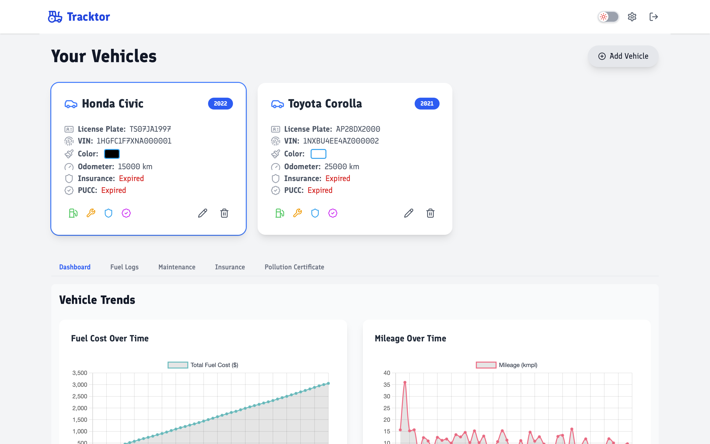
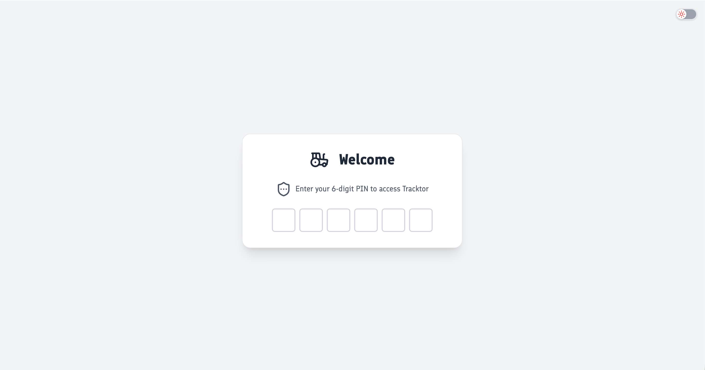
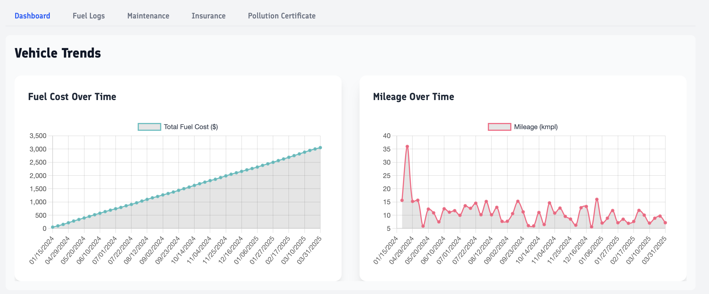
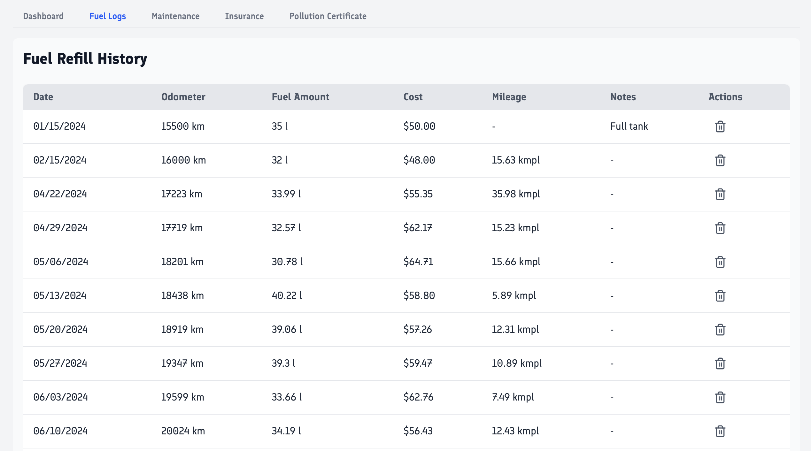
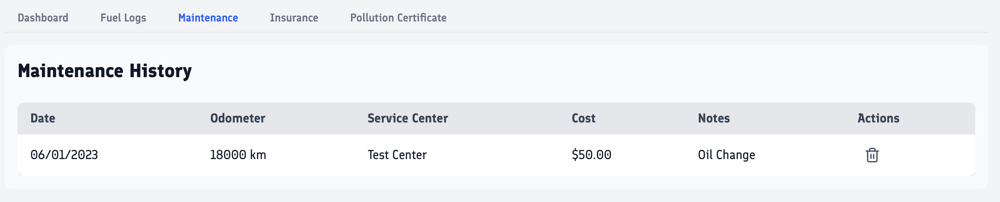
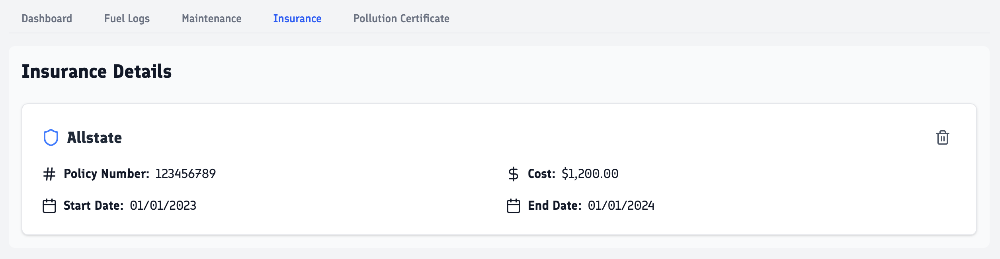
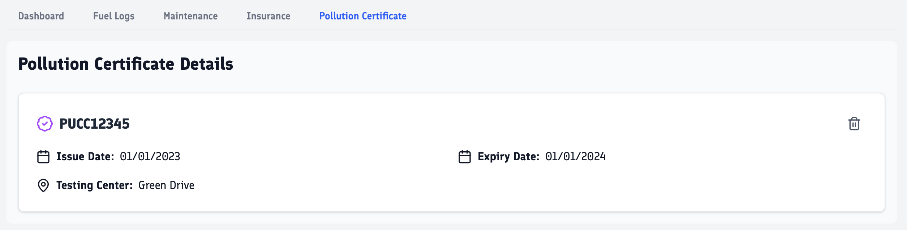

> ⚠️ **WARNING:**
> Tracktor is under active development. There may be frequent breaking changes, though we are taking precautions but it is **not stable for production use**.
> _Please keep regular backups of your data!_

  
  <h1 style="display:inline; font-size: 2.5rem; vertical-align: middle;">Tracktor</h1>

  <b>Tracktor</b> is an open-source web application for <b>comprehensive vehicle management</b>. 
  Easily track ⛽ fuel consumption, 🛠️ maintenance, 🛡️ insurance, and 📄 regulatory documents for all your vehicles in one place.

  <picture>
    <source media="(prefers-color-scheme: dark)" srcset="./docs/screenshots/dashboard-dark.png" />
    <source media="(prefers-color-scheme: light)" srcset="./docs/screenshots/dashboard-light.png" />
    
  </picture>

## ✨ Features

- 🚗 **Vehicle Management:** Add, edit, and manage multiple vehicles.
- ⛽ **Fuel Tracking:** Log fuel refills and monitor fuel efficiency over time.
- 🛠️ **Maintenance Log:** Record and view maintenance history for each vehicle.
- 📄 **Document Tracking:** Track insurance, pollution certificates, and other important documents.
- 📊 **Dashboard:** Visualize key metrics and upcoming renewals.
- 🔒 **User Authentication:** Secure access to your data.

## 🖼️ Screenshots

  <h3>🔐 Login Page</h3> 
  <picture>
    <source media="(prefers-color-scheme: dark)" srcset="./docs/screenshots/login-dark.png" />
    <source media="(prefers-color-scheme: light)" srcset="./docs/screenshots/login-light.png" />
    
  </picture>

  <h3>📈 Charts</h3> 
  <picture>
    <source media="(prefers-color-scheme: dark)" srcset="./docs/screenshots/charts-dark.png" />
    <source media="(prefers-color-scheme: light)" srcset="./docs/screenshots/charts-light.png" />
    
  </picture>

  <h3>⛽ Fuel Log</h3> 
  <picture>
    <source media="(prefers-color-scheme: dark)" srcset="./docs/screenshots/fuel-dark.png" />
    <source media="(prefers-color-scheme: light)" srcset="./docs/screenshots/fuel-light.png" />
    
  </picture>

  <h3>🛠️ Maintenance Log</h3> 
  <picture>
    <source media="(prefers-color-scheme: dark)" srcset="./docs/screenshots/maintenance-dark.png" />
    <source media="(prefers-color-scheme: light)" srcset="./docs/screenshots/maintenance-light.png" />
    
  </picture>

  <h3>🛡️ Insurance Details</h3> 
  <picture>
    <source media="(prefers-color-scheme: dark)" srcset="./docs/screenshots/insurance-dark.png" />
    <source media="(prefers-color-scheme: light)" srcset="./docs/screenshots/insurance-light.png" />
    
  </picture>

  <h3>📄 PUCC Details</h3> 
  <picture>
    <source media="(prefers-color-scheme: dark)" srcset="./docs/screenshots/pucc-dark.png" />
    <source media="(prefers-color-scheme: light)" srcset="./docs/screenshots/pucc-light.png" />
    
  </picture>

## 🛠️ Tech Stack

- 🎨 **Frontend:** SvelteKit, Tailwind CSS
- 🖥️ **Backend:** Node.js, Express.js
- 🗄️ **Database:** SQLite, sequelize ORM
- 🐳 **Containerization:** Docker & Docker Compose

## 🚀 Getting Started

Please check the [installation guide](./docs/INSTALL.md) for detailed instructions on setting up the project.

## 🤝 Contributing

Contributions are welcome! Please read the [contributing guidelines](./docs/CONTRIBUTING.md) before submitting a pull request.

Please consider supporting this project by giving it a star! ⭐ or [sponsoring](https://github.com/sponsors/javedh-dev).

## 📄 License

This project is licensed under the MIT License. See the [LICENSE](LICENSE) file for details.

## 📊 Repository activity

## ⭐ Star History

<a href="https://www.star-history.com/#javedh-dev/tracktor&Date">
 <picture>
   <source media="(prefers-color-scheme: dark)" srcset="https://api.star-history.com/svg?repos=javedh-dev/tracktor&type=Date&theme=dark" />
   <source media="(prefers-color-scheme: light)" srcset="https://api.star-history.com/svg?repos=javedh-dev/tracktor&type=Date" />
   
 </picture>
</a>

## 🤝 Contributors

