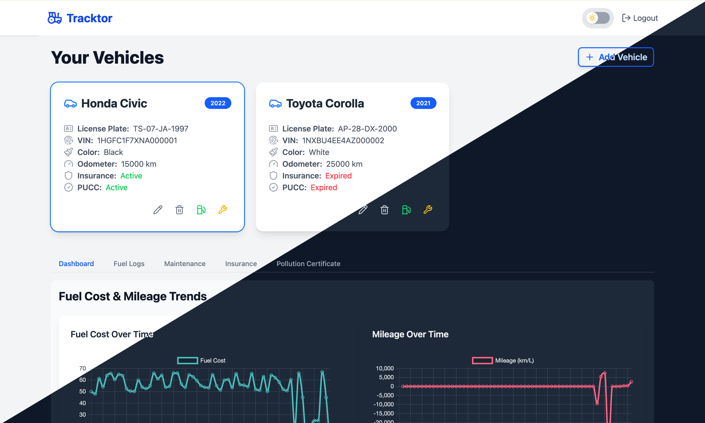
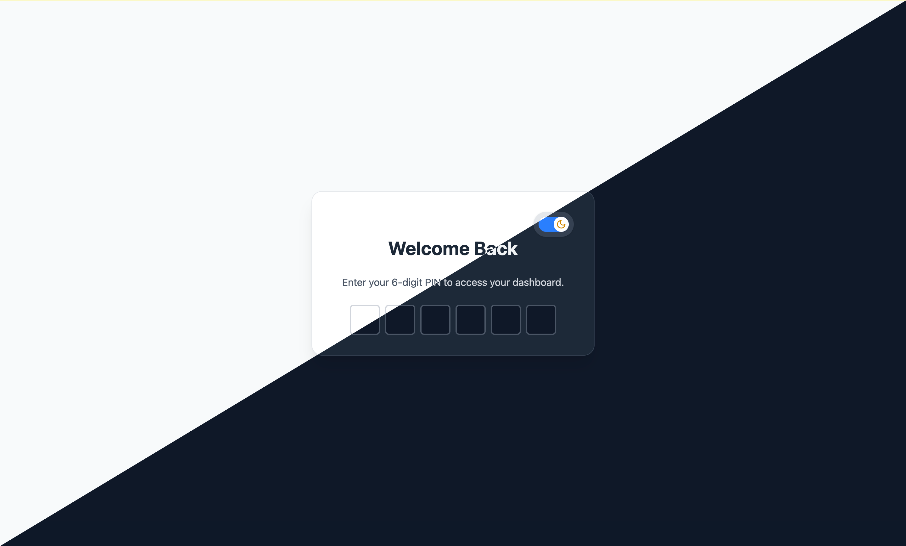
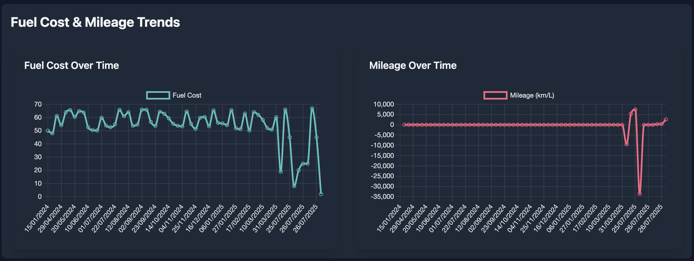
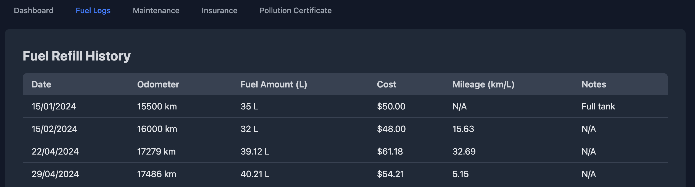
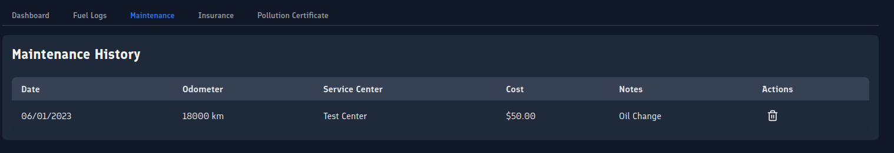
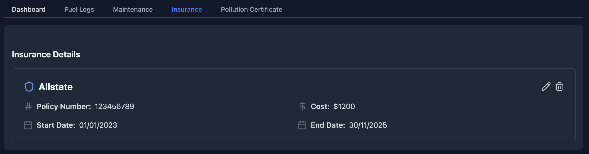
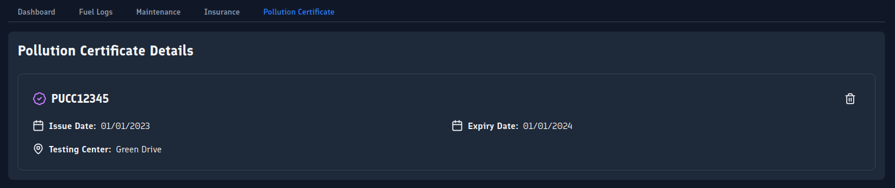

> ⚠️ **WARNING:**
> Tracktor is under very active development. There may be frequent breaking changes, and it is **not stable for production use**.
> _Please keep regular backups of your data!_

<div align="center" style="margin-bottom: 20px;">
  
  
  <h1 style="display:inline; font-size: 2.5rem; vertical-align: middle;">Tracktor</h1>
</div>

<p align="center" style="font-size: 1.2rem;">
  <b>Tracktor</b> is an open-source web application for <b>comprehensive vehicle management</b>.<br>
  Easily track <span style="color:#4ade80;">⛽ fuel</span> consumption, <span style="color:#fbbf24;">🛠️ maintenance</span>, <span style="color:#60a5fa;">🛡️ insurance</span>, and <span style="color:#a78bfa;">📄 regulatory documents</span> for all your vehicles in one place.
</p>

<p align="center">
  
</p>

## ✨ Features

- 🚗 **Vehicle Management:** Add, edit, and manage multiple vehicles.
- ⛽ **Fuel Tracking:** Log fuel refills and monitor fuel efficiency over time.
- 🛠️ **Maintenance Log:** Record and view maintenance history for each vehicle.
- 📄 **Document Tracking:** Track insurance, pollution certificates, and other important documents.
- 📊 **Dashboard:** Visualize key metrics and upcoming renewals.
- 🔒 **User Authentication:** Secure access to your data.

## 🖼️ Screenshots

<p align="center">
  <h3>🔐 Login Page</h3><br>
  
</p>
<p align="center">
  <h3>📈 Charts</h3><br>
  
</p>
<p align="center">
  <h3>⛽ Fuel Log</h3><br>
  
</p>
<p align="center">
  <h3>🛠️ Maintenance Log</h3><br>
  
</p>
<p align="center">
  <h3>🛡️ Insurance Details</h3><br>
  
</p>
<p align="center">
  <h3>📄 PUCC Details</h3><br>
  
</p>

## 🛠️ Tech Stack

- 🎨 **Frontend:** SvelteKit, Tailwind CSS
- 🖥️ **Backend:** Node.js, Express.js
- 🗄️ **Database:** SQLite
- 📚 **Documentation:** VitePress
- 🐳 **Containerization:** Docker & Docker Compose

## 🚀 Getting Started

### 📦 Prerequisites

- 🟢 Node.js (v18 or higher)
- 📦 npm
- 🐳 Docker & Docker Compose (for containerized setup)

### 🛠️ Installation (Development)

1. **Clone the repository:**
   ```bash
   git clone https://github.com/your-username/tracktor.git
   cd tracktor
   ```
2. **Install dependencies:**
   ```bash
   npm install
   ```
3. **Set up environment:**
   ```bash
   npm run setup
   ```
4. **Start the development server:**
   ```bash
   npm run dev
   ```
5. **Open your browser:**
   Navigate to `http://localhost:5173` for the frontend.

### 🐳 Running with Docker Compose

1. **Build and start all services:**
   ```bash
   docker-compose up --build
   ```
2. **Access the app:**
   - 🚜 Main App: `http://localhost:3000`
   - 📚 Docs: `http://localhost:5173`

## 🤝 Contributing

Contributions are welcome! Please read the [contributing guidelines](app/docs/contributing.md) before submitting a pull request. 🙏

## 📄 License

This project is licensed under the ISC License. See the [LICENSE](LICENSE) file for details.

## ⭐ Star History

<a href="https://www.star-history.com/#javedh-dev/tracktor&Date">
 <picture>
   <source media="(prefers-color-scheme: dark)" srcset="https://api.star-history.com/svg?repos=javedh-dev/tracktor&type=Date&theme=dark" />
   <source media="(prefers-color-scheme: light)" srcset="https://api.star-history.com/svg?repos=javedh-dev/tracktor&type=Date" />
   
 </picture>
</a>
