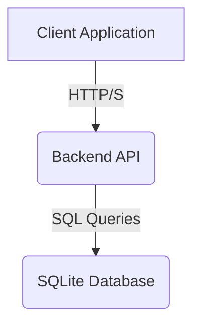
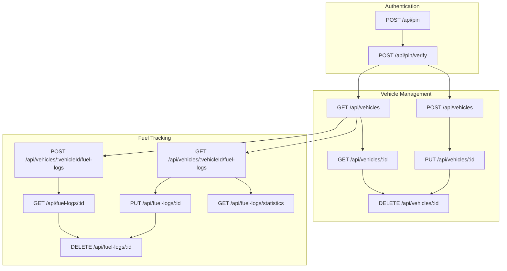
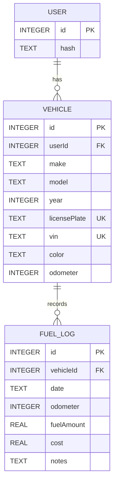

# Software Requirements Specification (SRS)
## Vehicle Tracking Management System

### 1. Introduction

This Software Requirements Specification (SRS) document details the functional and non-functional requirements for the Vehicle Tracking Management System. The system aims to provide a comprehensive solution for managing vehicle-related data, including fuel consumption, maintenance, and important document tracking.

### 2. Technical Stack Specification

The system is built using a modern and efficient technology stack to ensure performance, scalability, and maintainability.

*   **Frontend:** Svelte 5
*   **Styling:** Tailwind CSS
*   **Backend:** Express.js with TypeScript
*   **Database:** SQLite
*   **ORM:** Sequelize (Correction: The provided SRS.md mentions "Equalise ORM", but given the `server/package.json` and `server/models` directory, Sequelize is being used. I will proceed with Sequelize.)

### 3. System Architecture

The system follows a client-server architecture, with a clear separation of concerns between the frontend, backend, and database layers.

#### 3.1 High-Level System Architecture

#### 3.2 Frontend Architecture

The frontend is developed using Svelte 5, leveraging its reactive and component-based architecture for a highly performant and interactive user interface. Tailwind CSS is used for utility-first styling, ensuring a responsive and modern design across various devices.

*   **Svelte 5 Component-Based Architecture:** The UI is broken down into reusable and self-contained Svelte components, promoting modularity and maintainability.
*   **Reactive State Management:** Svelte's built-in reactivity simplifies state management, automatically updating the UI when data changes.
*   **Tailwind CSS for Responsive Design:** A utility-first CSS framework enables rapid UI development and ensures the application is visually appealing and functional on desktops, tablets, and mobile devices.
*   **Client-Side Routing:** SvelteKit handles efficient client-side navigation, providing a smooth single-page application experience.
*   **Performance-Optimized Rendering:** Svelte compiles components into highly efficient vanilla JavaScript, resulting in small bundle sizes and fast load times.

#### 3.3 Backend Architecture

The backend is built with Express.js and TypeScript, providing a robust and type-safe API layer. It adheres to RESTful principles for clear and consistent communication with the frontend.

*   **Express.js with TypeScript:** A fast, unopinionated, minimalist web framework for Node.js, enhanced with TypeScript for strong typing and improved code quality.
*   **RESTful API Design:** Standard HTTP methods (GET, POST, PUT, DELETE) are used for resource manipulation, ensuring a predictable and scalable API.
*   **Middleware-Based Authentication:** Authentication and authorization logic are implemented as Express middleware, allowing for centralized and reusable security checks.
*   **Modular Route Structure:** API endpoints are organized into distinct route files (e.g., `pinRoutes`, `vehicleRoutes`, `fuelLogRoutes`), improving code organization and readability.
*   **Type-Safe API Endpoints:** TypeScript interfaces and types are used to define request and response payloads, ensuring data consistency and reducing runtime errors.

#### 3.4 Database Design

SQLite is chosen as the database for its lightweight nature and ease of self-hosting. Sequelize, an ORM, is used to interact with the database, providing an abstraction layer for data operations.

*   **SQLite for Lightweight, Self-Hostable Solution:** Ideal for local development and deployment scenarios where a full-fledged database server is not required.
*   **Sequelize ORM for Database Interactions:** Simplifies database operations by mapping JavaScript objects to database rows, reducing boilerplate SQL code.
*   **Normalized Database Schema:** Data is organized to minimize redundancy and improve data integrity.
*   **Efficient Data Modeling:** Tables and relationships are designed to support efficient querying and data retrieval for all application features.

### 4. Detailed Feature Requirements

#### 4.1 User Management

##### Functional Requirements
*   **User Registration:** Users can register with a unique email/username and a secure password.
*   **Password Hashing and Secure Storage:** Passwords are securely hashed using bcrypt before storage to protect user credentials.
*   **PIN-Based Authentication:** The system uses a 6-digit PIN for authentication, which is hashed and stored.
*   **Profile Management:** Users can manage their profile information (though specific editable fields are not detailed in the provided SRS, this implies basic user data management).

##### Technical Specifications
*   **Svelte 5 Reactive Forms:** Forms for registration and PIN setup will leverage Svelte's reactivity for real-time validation and user feedback.
*   **TypeScript Interfaces for User Models:** `UserAttributes` interface defines the structure of user data, ensuring type safety.
*   **Middleware-Based Authentication:** `authenticatePin` middleware ensures that API requests are authorized using the `X-User-PIN` header.
*   **Secure PIN Handling:** PINs are hashed using `bcrypt` before storage, and verification is done by comparing the provided PIN with the stored hash.

#### 4.2 Vehicle Management

##### Functional Requirements
*   **Add Multiple Vehicles:** Users can add details for multiple vehicles they own or manage.
*   **Detailed Vehicle Profile:** Each vehicle entry includes comprehensive details such as make, model, year, license plate, VIN, color, and current odometer reading.
*   **Vehicle Identification Details:** Unique identifiers like license plate and VIN are enforced to prevent duplicate entries.
*   **Status Tracking:** (Implied by odometer, but no explicit status field is mentioned. This could be a future enhancement.)

##### Technical Specifications
*   **Svelte 5 Dynamic Forms:** Forms for adding and editing vehicle details are built with Svelte, providing a dynamic and user-friendly input experience.
*   **TypeScript Interfaces for Vehicle Models:** `VehicleAttributes` interface defines the structure of vehicle data, ensuring type safety and consistency.
*   **SQLite Storage with Sequelize ORM:** Vehicle data is persisted in the SQLite database via Sequelize models.
*   **Validation Rules:** Server-side validation ensures that required fields are present and unique constraints (license plate, VIN) are enforced.

#### 4.3 Fuel Tracking Module

##### Functional Requirements
*   **Fuel Fill-up Logging:** Users can record details of each fuel refill, including date, odometer reading, fuel amount, and cost.
*   **Mileage Calculation:** The system automatically calculates fuel efficiency (e.g., km/L or miles/gallon) based on consecutive fuel logs.
*   **Fuel Expense Tracking:** Records the cost of each refill, allowing for expense analysis.
*   **Graphical Fuel Consumption Analysis:** (Future enhancement, not explicitly implemented in current code but mentioned in SRS).

##### Technical Specifications
*   **Reactive Charts with Svelte:** (Future enhancement, not explicitly implemented in current code but mentioned in SRS).
*   **Date-Based Filtering:** Fuel logs can be filtered and ordered by date.
*   **Calculation Services:** Mileage calculation is performed on the backend when fetching fuel logs.
*   **Detailed Logging:** Fuel log entries store `date`, `odometer`, `fuelAmount`, `cost`, and optional `notes`.

#### 4.4 Maintenance Tracking (Future Enhancement)

##### Functional Requirements
*   **Service History Logging:** Record past maintenance services.
*   **Maintenance Schedules:** Define upcoming maintenance tasks.
*   **Reminder System:** Notify users about scheduled maintenance.
*   **Cost Tracking:** Log expenses related to maintenance.
*   **Parts Replacement Log:** Track replaced parts.

##### Technical Specifications
*   **Scheduled Job System:** (For reminders).
*   **Notification Mechanisms:** (For reminders).
*   **Comprehensive Logging:** Detailed data storage for maintenance records.
*   **Predictive Maintenance Suggestions:** (Advanced future enhancement).

#### 4.5 Insurance Management (Future Enhancement)

##### Functional Requirements
*   **Policy Detail Storage:** Store insurance policy information.
*   **Renewal Reminders:** Alert users about upcoming policy renewals.
*   **Document Upload:** Allow uploading of insurance documents.
*   **Expiration Alerts:** Notify users when policies are nearing expiration.

##### Technical Specifications
*   **File Upload Handling:** Securely manage document uploads.
*   **Secure Document Storage:** Ensure uploaded documents are stored safely.
*   **Automated Reminder System:** (For renewals and expirations).
*   **Notification Mechanisms:** (For alerts).

#### 4.6 Pollution Certificate Management (Future Enhancement)

##### Functional Requirements
*   **Certificate Upload:** Upload pollution certificates.
*   **Expiration Tracking:** Monitor certificate validity.
*   **Renewal Reminders:** Remind users about upcoming renewals.

##### Technical Specifications
*   **Document Storage:** Store certificate files.
*   **Automated Alerts:** (For renewals).
*   **Compliance Tracking:** (To ensure adherence to regulations).

### 5. Non-Functional Requirements

#### 5.1 Performance
*   **Svelte 5 Lightweight Rendering:** Ensures fast UI rendering and minimal client-side resource consumption.
*   **Efficient Database Queries:** Optimized Sequelize queries to minimize database load and response times.
*   **Minimal Resource Consumption:** The application is designed to be efficient in terms of CPU, memory, and network usage.
*   **Fast Load Times:** Optimized asset loading and efficient data fetching contribute to quick application startup.

#### 5.2 Security
*   **PIN-Based Authentication:** All sensitive API endpoints are protected by PIN authentication.
*   **HTTPS Support:** (Implied for production, but currently running on HTTP for development).
*   **Input Validation:** Server-side validation prevents malicious or malformed data from being processed.
*   **Role-Based Access Control:** (Future enhancement, currently a single user with PIN).
*   **Secure File Handling:** (For document uploads, future enhancement).

#### 5.3 Usability
*   **Responsive Tailwind CSS Design:** The UI adapts seamlessly to different screen sizes, providing a consistent user experience across devices.
*   **Mobile-Friendly Interface:** Designed with mobile users in mind, ensuring ease of use on smartphones and tablets.
*   **Intuitive Navigation:** Clear and logical navigation paths allow users to easily find and access features.
*   **Accessibility Considerations:** (General principle, specific details not provided in SRS.md).

### 6. API Endpoint Structure

The API follows a RESTful design, organizing resources logically.

### 7. Database Schema

The database schema is designed to store user, vehicle, and fuel log information.

### 8. Deployment Considerations

*   **Docker Containerization:** The application can be easily containerized using Docker for consistent deployment across different environments.
*   **Environment Configuration:** Configuration settings (e.g., database path, port) are managed through environment variables.
*   **Easy Self-Hosting:** Designed for straightforward deployment on various platforms with minimal dependencies.
*   **Minimal System Requirements:** The lightweight nature of SQLite and Express.js ensures the application can run efficiently on systems with limited resources.

### 9. Future Enhancements

*   **Mobile App Development:** Native mobile applications for iOS and Android to extend accessibility.
*   **Advanced Reporting:** More sophisticated reporting and analytics features for vehicle data.
*   **Machine Learning Predictions:** Implement ML models for predictive maintenance or fuel efficiency recommendations.
*   **Third-Party Integrations:** Integration with external services like mapping APIs, payment gateways, or vehicle data providers.
*   **Maintenance Tracking Module:** Full implementation of maintenance logging, scheduling, and reminders.
*   **Insurance Management Module:** Full implementation of policy storage, reminders, and document management.
*   **Pollution Certificate Management Module:** Full implementation of certificate tracking and reminders.
