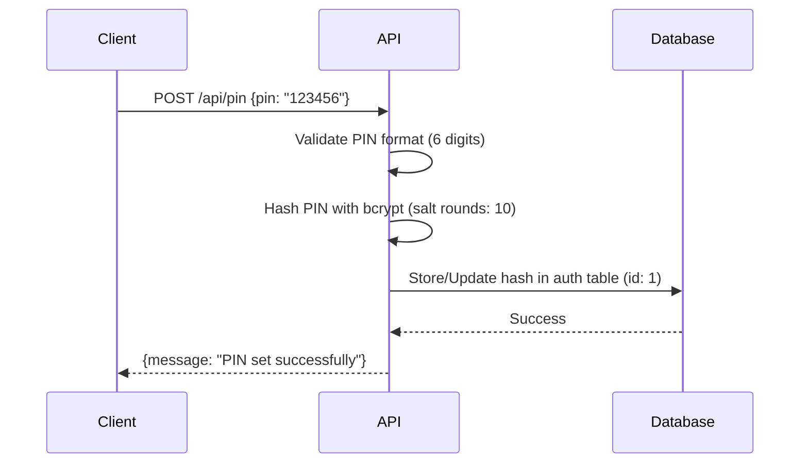
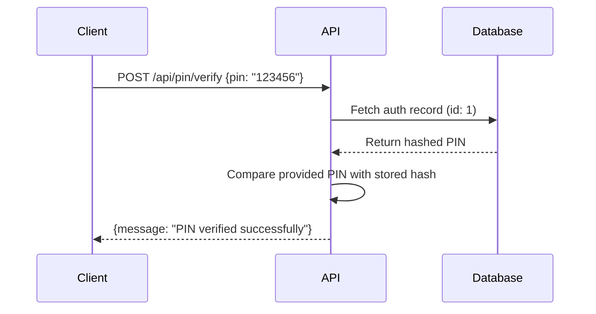
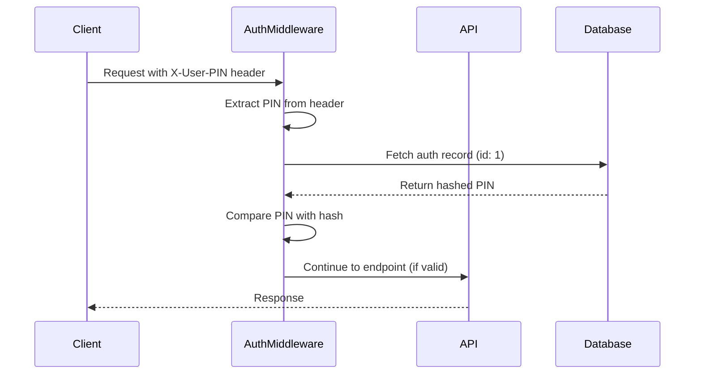

# Authentication and Middleware Analysis

This document provides a comprehensive analysis of the authentication system, middleware components, and error handling patterns in the Tracktor application.

## Authentication System Overview

The Tracktor application uses a **PIN-based authentication system** with the following characteristics:

- **Single-user system**: One PIN for the entire application
- **Stateless authentication**: PIN must be provided with each request
- **Bcrypt hashing**: PINs are hashed using bcrypt with salt rounds of 10
- **Header-based**: Authentication via `X-User-PIN` header
- **Rate limiting**: PIN verification endpoint is rate-limited

## Authentication Flow

### 1. PIN Setup Flow



### 2. PIN Verification Flow



### 3. Protected Endpoint Access Flow



## Authentication Middleware

### `authenticatePin` Middleware

**File**: `app/backend/src/middleware/auth.ts`

**Purpose**: Validates PIN for protected endpoints

**Implementation Details**:

```typescript
export const authenticatePin = async (req, res, next) => {
  const pin = req.headers["x-user-pin"] as string;

  // 1. Check if PIN header exists
  if (!pin) {
    return res.status(401).json({
      message: "PIN is required in X-User-PIN header.",
    });
  }

  // 2. Fetch stored PIN hash
  const user = await Auth.findByPk(1);
  if (!user) {
    return res.status(401).json({
      message: "PIN is not set. Please set the PIN first.",
    });
  }

  // 3. Verify PIN against stored hash
  const match = await bcrypt.compare(pin, user.hash);
  if (match) {
    next(); // Continue to protected endpoint
  } else {
    res.status(401).json({ message: "Invalid PIN." });
  }
};
```

**Error Scenarios**:

- **Missing Header**: 401 - "PIN is required in X-User-PIN header"
- **PIN Not Set**: 401 - "PIN is not set. Please set the PIN first"
- **Invalid PIN**: 401 - "Invalid PIN"
- **Server Error**: 500 - "Error authenticating PIN"

## Security Features

### 1. Rate Limiting

**Applied to**: `POST /api/pin/verify`

**Configuration**:

```typescript
const pinVerifyLimiter = rateLimit({
  windowMs: 5 * 60 * 1000, // 5 minutes
  max: 5, // limit each IP to 5 requests per windowMs
  message: "Too many PIN verification attempts, please try again later.",
});
```

**Purpose**: Prevent brute-force attacks on PIN verification

### 2. PIN Validation

**Format Requirements**:

- Exactly 6 digits
- Numeric characters only
- Validated using regex: `/^\d+$/`

**Validation Logic**:

```typescript
if (!pin || pin.length !== 6 || !/^\d+$/.test(pin)) {
  throw new AuthError("PIN must be a 6-digit number.", Status.BAD_REQUEST);
}
```

### 3. Password Hashing

**Algorithm**: bcrypt
**Salt Rounds**: 10
**Implementation**:

```typescript
const hash = await bcrypt.hash(pin, 10);
const match = await bcrypt.compare(pin, auth.hash);
```

## Middleware Components

### 1. Async Handler Middleware

**File**: `app/backend/src/middleware/async-handler.ts`

**Purpose**: Wraps async route handlers to catch errors and pass them to Express error handler

**Implementation**:

```typescript
export const asyncHandler = (fn) => {
  return (req, res, next) => {
    Promise.resolve(fn(req, res, next)).catch(next);
  };
};
```

**Usage**: All route handlers are wrapped with `asyncHandler`

### 2. Error Handler Middleware

**File**: `app/backend/src/middleware/error-handler.ts`

**Purpose**: Centralized error handling for all API endpoints

**Error Types Handled**:

1. **SequelizeValidationError** (400)

   ```json
   {
     "type": "ValidationError",
     "errors": [
       {
         "message": "Validation error message",
         "path": "field_name"
       }
     ]
   }
   ```

2. **AuthError** (401/403/500)

   ```json
   {
     "type": "AuthError",
     "errors": [
       {
         "message": "Authentication error message"
       }
     ]
   }
   ```

3. **Custom Service Errors** (400/404/409/500)

   ```json
   {
     "type": "VehicleError",
     "errors": [
       {
         "message": "Service-specific error message"
       }
     ]
   }
   ```

4. **Generic Errors** (500)
   ```json
   {
     "type": "Error",
     "errors": [
       {
         "message": "Internal server error"
       }
     ]
   }
   ```

## Error Handling System

### Service Error Hierarchy

**Base Class**: `ServiceError`

```typescript
export class ServiceError extends Error {
  status: Status;
  constructor(name: string, message: string, status: Status) {
    super(message);
    this.name = name;
    this.status = status;
  }
}
```

**Status Codes**:

```typescript
export enum Status {
  BAD_REQUEST = 400,
  UNAUTHORIZED = 403,
  NOT_FOUND = 404,
  CONFLICT = 409,
  INTERNAL_SERVER_ERROR = 500,
}
```

**Domain-Specific Errors**:

- `AuthError` - Authentication and authorization errors
- `VehicleError` - Vehicle-related business logic errors
- `FuelLogError` - Fuel log validation and business errors
- `InsuranceError` - Insurance policy validation errors
- `MaintenanceLogError` - Maintenance log validation errors
- `PollutionCertificateError` - PUCC validation errors
- `ConfigError` - Configuration management errors

### Error Response Format

All API errors follow a consistent format:

```typescript
{
  type: string,        // Error class name
  errors: [
    {
      message: string, // Human-readable error message
      path?: string    // Field name (for validation errors)
    }
  ]
}
```

## OpenAPI Security Scheme

Based on the authentication analysis, the OpenAPI specification should include:

### Security Scheme Definition

```yaml
components:
  securitySchemes:
    PinAuth:
      type: apiKey
      in: header
      name: X-User-PIN
      description: 6-digit PIN for authentication
```

### Security Requirements

```yaml
security:
  - PinAuth: [] # Applied to protected endpoints
```

### Endpoint-Specific Security

- **Public Endpoints** (no security):
  - `POST /api/pin`
  - `POST /api/pin/verify`
  - `GET /api/pin/status`
  - `GET /api/config`
  - `GET /api/config/{key}`
  - `PUT /api/config`

- **Protected Endpoints** (require PinAuth):
  - All vehicle management endpoints
  - All fuel log endpoints
  - All insurance endpoints
  - All maintenance log endpoints
  - All PUCC endpoints

## Authentication Best Practices Implemented

1. **Password Hashing**: Using bcrypt with appropriate salt rounds
2. **Rate Limiting**: Preventing brute-force attacks on authentication
3. **Stateless Design**: No session management, PIN required per request
4. **Consistent Error Handling**: Standardized error responses
5. **Input Validation**: PIN format validation before processing
6. **Error Logging**: Server-side error logging for debugging
7. **Secure Headers**: Using custom header for PIN transmission

## Security Considerations

### Strengths

- Strong password hashing with bcrypt
- Rate limiting on authentication endpoints
- Consistent error handling
- Input validation

### Areas for Enhancement

- Consider HTTPS enforcement
- Add request/response logging for audit trails
- Implement PIN complexity requirements
- Consider PIN expiration policies
- Add account lockout after multiple failed attempts

This authentication and middleware analysis provides the foundation for creating accurate OpenAPI security specifications and understanding the complete request/response flow for all API endpoints.
