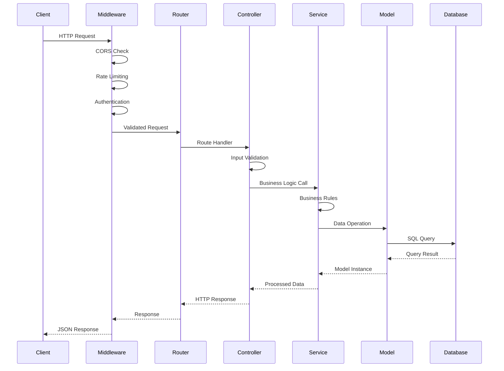
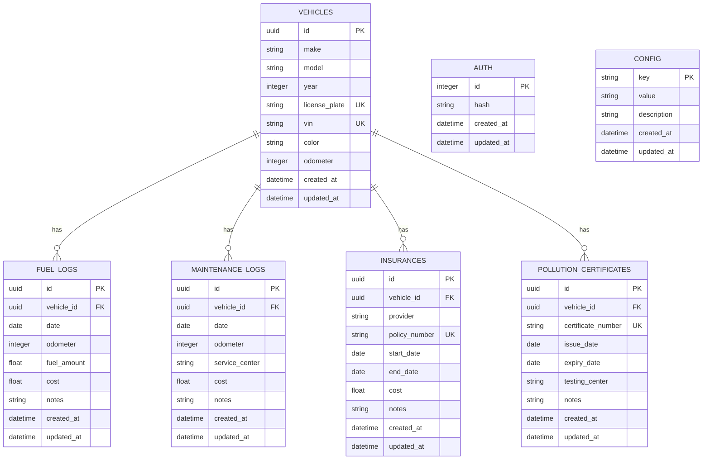

# Backend Architecture

The Tracktor backend is built with Node.js and Express.js, following a layered architecture pattern that separates concerns between routing, business logic, and data access. The system emphasizes type safety, security, and maintainability.

## Technology Stack

### Core Framework

- **Node.js**: JavaScript runtime with ES module support
- **Express.js 4.x**: Web application framework
- **TypeScript**: Type safety and enhanced developer experience
- **ES Modules**: Modern module system with import/export

### Database & ORM

- **SQLite 3**: Embedded relational database
- **Sequelize 6.x**: Object-Relational Mapping (ORM)
- **Umzug**: Database migration management

### Security & Authentication

- **bcrypt**: Password hashing for PIN authentication
- **CORS**: Cross-Origin Resource Sharing configuration
- **express-rate-limit**: API rate limiting
- **Input validation**: Request validation and sanitization

### Development Tools

- **tsx**: TypeScript execution for development
- **nodemon**: Development server with auto-restart
- **ESLint**: Code linting and style enforcement
- **Prettier**: Code formatting

## Project Structure

```
src/
├── config/
│   └── env.ts              # Environment configuration
├── controllers/            # HTTP request handlers
│   ├── ConfigController.ts
│   ├── FuelLogController.ts
│   ├── InsuranceController.ts
│   ├── MaintenanceLogController.ts
│   ├── PinController.ts
│   ├── PUCCController.ts
│   └── VehicleController.ts
├── db/                     # Database configuration and migrations
│   ├── db.ts              # Database connection
│   ├── index.ts           # Migration utilities
│   ├── init.ts            # Database initialization
│   ├── migrate.ts         # Migration CLI tool
│   ├── migrations/        # Schema migrations
│   └── seeders/           # Data seeders
├── exceptions/            # Custom error classes
│   ├── AuthError.ts
│   ├── ConfigError.ts
│   ├── FuelLogError.ts
│   ├── InsuranceError.ts
│   ├── MaintenanceLogError.ts
│   ├── PollutionCertificateError.ts
│   ├── ServiceError.ts
│   └── VehicleError.ts
├── middleware/            # Express middleware
│   ├── async-handler.ts   # Async error handling
│   ├── auth.ts           # Authentication middleware
│   └── error-handler.ts  # Global error handling
├── models/               # Sequelize model definitions
│   ├── Auth.ts
│   ├── Config.ts
│   ├── FuelLog.ts
│   ├── Insurance.ts
│   ├── MaintenanceLog.ts
│   ├── PUCC.ts
│   ├── Vehicle.ts
│   └── index.ts          # Model associations
├── routes/               # Express route definitions
│   ├── configRoutes.ts
│   ├── pinRoutes.ts
│   └── vehicleRoutes.ts
└── services/             # Business logic layer
    ├── configService.ts
    ├── fuelLogService.ts
    ├── insuranceService.ts
    ├── maintenanceLogService.ts
    ├── pinService.ts
    ├── pollutionCertificateService.ts
    └── vehicleService.ts
```

## Layered Architecture

### 1. Presentation Layer (Controllers)

Controllers handle HTTP requests and responses, delegating business logic to services:

```typescript
// Example: VehicleController.ts
export class VehicleController {
  static async getAllVehicles(req: Request, res: Response) {
    const vehicles = await VehicleService.getAllVehicles();
    res.json(vehicles);
  }

  static async createVehicle(req: Request, res: Response) {
    const vehicleData = req.body;
    const vehicle = await VehicleService.createVehicle(vehicleData);
    res.status(201).json(vehicle);
  }
}
```

**Responsibilities:**

- HTTP request/response handling
- Input validation and sanitization
- Response formatting
- Error handling delegation

### 2. Business Logic Layer (Services)

Services contain the core business logic and coordinate between controllers and models:

```typescript
// Example: VehicleService.ts
export class VehicleService {
  static async getAllVehicles(): Promise<Vehicle[]> {
    return await Vehicle.findAll({
      include: ["insurance", "fuelLogs", "maintenanceLogs"],
    });
  }

  static async createVehicle(data: VehicleData): Promise<Vehicle> {
    // Business logic validation
    await this.validateVehicleData(data);

    // Create vehicle with transaction
    return await sequelize.transaction(async (t) => {
      return await Vehicle.create(data, { transaction: t });
    });
  }
}
```

**Responsibilities:**

- Business rule enforcement
- Data validation and transformation
- Transaction management
- Cross-entity operations

### 3. Data Access Layer (Models)

Sequelize models define data structures and database interactions:

```typescript
// Example: Vehicle.ts
export default class Vehicle extends Model<
  VehicleAttributes,
  VehicleCreationAttributes
> {
  public id!: string;
  public make!: string;
  public model!: string;
  public year!: number;
  public licensePlate!: string;
  public vin?: string;
  public color?: string;
  public odometer?: number;

  // Associations
  public insurance?: Insurance[];
  public fuelLogs?: FuelLog[];
  public maintenanceLogs?: MaintenanceLog[];
}
```

**Responsibilities:**

- Data structure definition
- Database schema mapping
- Relationship definitions
- Query optimization

## Request Flow Architecture



## Authentication Architecture

### PIN-Based Authentication

The system uses a simple but secure PIN-based authentication:

```typescript
// Authentication Flow
export class AuthMiddleware {
  static async validatePin(req: Request, res: Response, next: NextFunction) {
    const pin = req.headers["x-user-pin"] as string;

    if (!pin) {
      throw new AuthError("PIN required");
    }

    const isValid = await PinService.validatePin(pin);
    if (!isValid) {
      throw new AuthError("Invalid PIN");
    }

    next();
  }
}
```

### Security Features

1. **PIN Hashing**: bcrypt with salt rounds for secure storage
2. **Rate Limiting**: Prevents brute force attacks
3. **CORS Configuration**: Explicit origin allowlisting
4. **Input Validation**: Request sanitization and validation
5. **Error Handling**: Secure error messages without information leakage

## Database Architecture

### Schema Design



### Migration System

```typescript
// Migration Pattern
export const up: Migration = async ({ context: queryInterface }) => {
  const transaction = await queryInterface.sequelize.transaction();

  try {
    await queryInterface.createTable(
      "vehicles",
      {
        // Table definition
      },
      { transaction }
    );

    await transaction.commit();
  } catch (error) {
    await transaction.rollback();
    throw error;
  }
};
```

**Migration Features:**

- **Transactional**: All-or-nothing migration execution
- **Reversible**: Down migrations for rollback capability
- **Version Control**: Sequential migration numbering
- **Environment Aware**: Different configurations per environment

## API Design Patterns

### RESTful Endpoints

```typescript
// Resource-based URL structure
GET    /api/vehicles           # List all vehicles
POST   /api/vehicles           # Create new vehicle
GET    /api/vehicles/:id       # Get specific vehicle
PUT    /api/vehicles/:id       # Update vehicle
DELETE /api/vehicles/:id       # Delete vehicle

GET    /api/vehicles/:id/fuel-logs    # Get vehicle fuel logs
POST   /api/vehicles/:id/fuel-logs    # Add fuel log
```

### Response Patterns

```typescript
// Success Response
{
  "success": true,
  "data": {
    "id": "uuid",
    "make": "Toyota",
    "model": "Camry"
  }
}

// Error Response
{
  "success": false,
  "error": {
    "code": "VALIDATION_ERROR",
    "message": "Invalid vehicle data",
    "details": {
      "year": "Year must be between 1900 and current year"
    }
  }
}
```

### Validation Patterns

```typescript
// Input Validation
export const validateVehicleData = (data: any): VehicleData => {
  const schema = Joi.object({
    make: Joi.string().required().min(1).max(50),
    model: Joi.string().required().min(1).max(50),
    year: Joi.number().integer().min(1900).max(new Date().getFullYear()),
    licensePlate: Joi.string()
      .required()
      .pattern(/^[A-Z0-9-]+$/),
    vin: Joi.string().optional().length(17),
    color: Joi.string().optional().max(30),
    odometer: Joi.number().integer().min(0).optional(),
  });

  const { error, value } = schema.validate(data);
  if (error) {
    throw new ValidationError(error.details);
  }

  return value;
};
```

## Error Handling Architecture

### Custom Error Classes

```typescript
// Base Error Class
export class ServiceError extends Error {
  public statusCode: number;
  public code: string;

  constructor(
    message: string,
    statusCode: number = 500,
    code: string = "INTERNAL_ERROR"
  ) {
    super(message);
    this.statusCode = statusCode;
    this.code = code;
    this.name = this.constructor.name;
  }
}

// Specific Error Types
export class VehicleError extends ServiceError {
  constructor(message: string, code: string = "VEHICLE_ERROR") {
    super(message, 400, code);
  }
}
```

### Global Error Handler

```typescript
export const errorHandler = (
  error: Error,
  req: Request,
  res: Response,
  next: NextFunction
) => {
  if (error instanceof ServiceError) {
    return res.status(error.statusCode).json({
      success: false,
      error: {
        code: error.code,
        message: error.message,
      },
    });
  }

  // Log unexpected errors
  console.error("Unexpected error:", error);

  res.status(500).json({
    success: false,
    error: {
      code: "INTERNAL_ERROR",
      message: "An unexpected error occurred",
    },
  });
};
```

## Performance Optimizations

### Database Optimizations

- **Connection Pooling**: Sequelize connection pool management
- **Query Optimization**: Eager loading with includes
- **Indexing**: Proper indexes on foreign keys and unique constraints
- **Transaction Management**: Efficient transaction scoping

### Caching Strategies

- **Model Caching**: Sequelize built-in caching
- **Response Caching**: HTTP cache headers for static data
- **Query Result Caching**: In-memory caching for frequent queries

### Memory Management

- **Connection Limits**: Proper connection pool sizing
- **Garbage Collection**: Efficient object lifecycle management
- **Memory Monitoring**: Process memory usage tracking

## Environment Configuration

### Configuration Management

```typescript
// Environment Configuration
export const env = {
  NODE_ENV: process.env.NODE_ENV || "development",
  SERVER_PORT: parseInt(process.env.PORT || "3000"),
  SERVER_HOST: process.env.HOST || "localhost",
  DATABASE_PATH: process.env.DB_PATH || "./tracktor.db",
  DEMO_MODE: process.env.DEMO_MODE === "true",
  CORS_ORIGINS: process.env.CORS_ORIGINS?.split(",") || [
    "http://localhost:5173",
  ],

  isProduction: () => env.NODE_ENV === "production",
  isDevelopment: () => env.NODE_ENV === "development",
};
```

### Environment Validation

```typescript
export const validateEnvironment = () => {
  const required = ["NODE_ENV"];
  const missing = required.filter((key) => !process.env[key]);

  if (missing.length > 0) {
    throw new Error(
      `Missing required environment variables: ${missing.join(", ")}`
    );
  }
};
```

This backend architecture provides a robust, scalable foundation for the Tracktor application while maintaining simplicity and following Node.js best practices.
