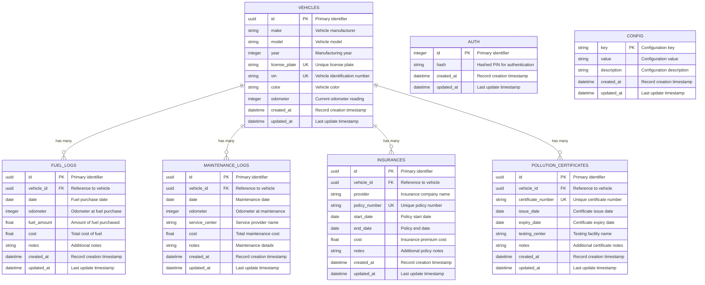

# Database Schema Documentation

The Tracktor application uses SQLite as its database engine with Sequelize ORM for data modeling and migrations. The schema is designed to efficiently store vehicle information and related tracking data while maintaining referential integrity.

## Database Technology

### SQLite Configuration

- **Engine**: SQLite 3.x
- **File Location**: `./tracktor.db` (configurable via `DB_PATH` environment variable)
- **Connection**: Single connection with WAL mode for better concurrency
- **Transactions**: ACID compliance with proper transaction management

### ORM Configuration

- **Sequelize Version**: 6.x
- **Dialect**: sqlite
- **Logging**: Configurable via `SHOW_SQL` environment variable
- **Migrations**: Umzug-based migration system
- **Associations**: Proper foreign key relationships with cascade options

## Schema Overview



## Table Definitions

### Vehicles Table

The central table storing vehicle information.

```sql
CREATE TABLE vehicles (
    id TEXT PRIMARY KEY DEFAULT (uuid()),
    make TEXT NOT NULL,
    model TEXT NOT NULL,
    year INTEGER NOT NULL,
    license_plate TEXT NOT NULL UNIQUE,
    vin TEXT UNIQUE,
    color TEXT,
    odometer INTEGER,
    created_at DATETIME NOT NULL DEFAULT CURRENT_TIMESTAMP,
    updated_at DATETIME NOT NULL DEFAULT CURRENT_TIMESTAMP
);
```

**Field Specifications:**

- `id`: UUID primary key for unique identification
- `make`: Vehicle manufacturer (required, max 50 characters)
- `model`: Vehicle model (required, max 50 characters)
- `year`: Manufacturing year (required, 1900-current year)
- `license_plate`: Unique license plate identifier (required)
- `vin`: Vehicle Identification Number (optional, 17 characters when present)
- `color`: Vehicle color (optional, max 30 characters)
- `odometer`: Current odometer reading in miles/kilometers (optional)

**Constraints:**

- Primary key on `id`
- Unique constraint on `license_plate`
- Unique constraint on `vin` (when not null)
- Check constraint on `year` (>= 1900 AND <= current year)
- Check constraint on `odometer` (>= 0)

### Fuel Logs Table

Tracks fuel purchases and consumption data.

```sql
CREATE TABLE fuel_logs (
    id TEXT PRIMARY KEY DEFAULT (uuid()),
    vehicle_id TEXT NOT NULL,
    date DATE NOT NULL,
    odometer INTEGER NOT NULL,
    fuel_amount REAL NOT NULL,
    cost REAL NOT NULL,
    notes TEXT,
    created_at DATETIME NOT NULL DEFAULT CURRENT_TIMESTAMP,
    updated_at DATETIME NOT NULL DEFAULT CURRENT_TIMESTAMP,
    FOREIGN KEY (vehicle_id) REFERENCES vehicles(id) ON DELETE CASCADE ON UPDATE CASCADE
);
```

**Field Specifications:**

- `vehicle_id`: Foreign key reference to vehicles table
- `date`: Date of fuel purchase (required)
- `odometer`: Odometer reading at time of purchase (required)
- `fuel_amount`: Amount of fuel purchased in liters/gallons (required, > 0)
- `cost`: Total cost of fuel purchase (required, >= 0)
- `notes`: Additional notes about the fuel purchase (optional)

**Constraints:**

- Foreign key constraint with CASCADE delete/update
- Check constraint on `fuel_amount` (> 0)
- Check constraint on `cost` (>= 0)
- Index on `vehicle_id` for query performance
- Index on `date` for chronological queries

### Maintenance Logs Table

Records vehicle maintenance and service history.

```sql
CREATE TABLE maintenance_logs (
    id TEXT PRIMARY KEY DEFAULT (uuid()),
    vehicle_id TEXT NOT NULL,
    date DATE NOT NULL,
    odometer INTEGER NOT NULL,
    service_center TEXT NOT NULL,
    cost REAL NOT NULL,
    notes TEXT,
    created_at DATETIME NOT NULL DEFAULT CURRENT_TIMESTAMP,
    updated_at DATETIME NOT NULL DEFAULT CURRENT_TIMESTAMP,
    FOREIGN KEY (vehicle_id) REFERENCES vehicles(id) ON DELETE CASCADE ON UPDATE CASCADE
);
```

**Field Specifications:**

- `vehicle_id`: Foreign key reference to vehicles table
- `date`: Date of maintenance service (required)
- `odometer`: Odometer reading at time of service (required)
- `service_center`: Name of service provider (required, max 100 characters)
- `cost`: Total cost of maintenance (required, >= 0)
- `notes`: Detailed description of maintenance performed (optional)

**Constraints:**

- Foreign key constraint with CASCADE delete/update
- Check constraint on `cost` (>= 0)
- Index on `vehicle_id` for query performance
- Index on `date` for chronological queries

### Insurance Table

Manages vehicle insurance policy information.

```sql
CREATE TABLE insurances (
    id TEXT PRIMARY KEY DEFAULT (uuid()),
    vehicle_id TEXT NOT NULL,
    provider TEXT NOT NULL,
    policy_number TEXT NOT NULL UNIQUE,
    start_date DATE NOT NULL,
    end_date DATE NOT NULL,
    cost REAL NOT NULL,
    notes TEXT,
    created_at DATETIME NOT NULL DEFAULT CURRENT_TIMESTAMP,
    updated_at DATETIME NOT NULL DEFAULT CURRENT_TIMESTAMP,
    FOREIGN KEY (vehicle_id) REFERENCES vehicles(id) ON DELETE CASCADE ON UPDATE CASCADE
);
```

**Field Specifications:**

- `vehicle_id`: Foreign key reference to vehicles table
- `provider`: Insurance company name (required, max 100 characters)
- `policy_number`: Unique policy identifier (required)
- `start_date`: Policy effective start date (required)
- `end_date`: Policy expiration date (required)
- `cost`: Insurance premium cost (required, >= 0)
- `notes`: Additional policy information (optional)

**Constraints:**

- Foreign key constraint with CASCADE delete/update
- Unique constraint on `policy_number`
- Check constraint on `cost` (>= 0)
- Check constraint ensuring `end_date` > `start_date`
- Index on `vehicle_id` for query performance
- Index on `end_date` for expiration tracking

### Pollution Certificates Table

Tracks pollution control certificates and emissions testing.

```sql
CREATE TABLE pollution_certificates (
    id TEXT PRIMARY KEY DEFAULT (uuid()),
    vehicle_id TEXT NOT NULL,
    certificate_number TEXT NOT NULL UNIQUE,
    issue_date DATE NOT NULL,
    expiry_date DATE NOT NULL,
    testing_center TEXT NOT NULL,
    notes TEXT,
    created_at DATETIME NOT NULL DEFAULT CURRENT_TIMESTAMP,
    updated_at DATETIME NOT NULL DEFAULT CURRENT_TIMESTAMP,
    FOREIGN KEY (vehicle_id) REFERENCES vehicles(id) ON DELETE CASCADE ON UPDATE CASCADE
);
```

**Field Specifications:**

- `vehicle_id`: Foreign key reference to vehicles table
- `certificate_number`: Unique certificate identifier (required)
- `issue_date`: Certificate issue date (required)
- `expiry_date`: Certificate expiration date (required)
- `testing_center`: Emissions testing facility name (required, max 100 characters)
- `notes`: Additional certificate information (optional)

**Constraints:**

- Foreign key constraint with CASCADE delete/update
- Unique constraint on `certificate_number`
- Check constraint ensuring `expiry_date` > `issue_date`
- Index on `vehicle_id` for query performance
- Index on `expiry_date` for expiration tracking

### Authentication Table

Stores hashed PIN for application authentication.

```sql
CREATE TABLE auth (
    id INTEGER PRIMARY KEY AUTOINCREMENT,
    hash TEXT NOT NULL,
    created_at DATETIME NOT NULL DEFAULT CURRENT_TIMESTAMP,
    updated_at DATETIME NOT NULL DEFAULT CURRENT_TIMESTAMP
);
```

**Field Specifications:**

- `id`: Auto-incrementing integer primary key
- `hash`: bcrypt hashed PIN (required)

**Security Notes:**

- Only stores hashed PINs, never plain text
- Uses bcrypt with appropriate salt rounds
- Single row table (only one PIN supported)

### Configuration Table

Stores application configuration key-value pairs.

```sql
CREATE TABLE config (
    key TEXT PRIMARY KEY,
    value TEXT NOT NULL,
    description TEXT,
    created_at DATETIME NOT NULL DEFAULT CURRENT_TIMESTAMP,
    updated_at DATETIME NOT NULL DEFAULT CURRENT_TIMESTAMP
);
```

**Field Specifications:**

- `key`: Configuration key identifier (primary key)
- `value`: Configuration value (required)
- `description`: Human-readable description of the configuration (optional)

## Relationships and Associations

### One-to-Many Relationships

```typescript
// Sequelize Association Definitions
Vehicle.hasMany(FuelLog, {
  foreignKey: "vehicleId",
  as: "fuelLogs",
  onDelete: "CASCADE",
  onUpdate: "CASCADE",
});

Vehicle.hasMany(MaintenanceLog, {
  foreignKey: "vehicleId",
  as: "maintenanceLogs",
  onDelete: "CASCADE",
  onUpdate: "CASCADE",
});

Vehicle.hasMany(Insurance, {
  foreignKey: "vehicleId",
  as: "insurance",
  onDelete: "CASCADE",
  onUpdate: "CASCADE",
});

Vehicle.hasMany(PollutionCertificate, {
  foreignKey: "vehicleId",
  as: "pollutionCertificate",
  onDelete: "CASCADE",
  onUpdate: "CASCADE",
});
```

### Inverse Relationships

```typescript
FuelLog.belongsTo(Vehicle, { foreignKey: "vehicleId", as: "vehicle" });
MaintenanceLog.belongsTo(Vehicle, { foreignKey: "vehicleId", as: "vehicle" });
Insurance.belongsTo(Vehicle, { foreignKey: "vehicleId", as: "vehicle" });
PollutionCertificate.belongsTo(Vehicle, {
  foreignKey: "vehicleId",
  as: "vehicle",
});
```

## Indexing Strategy

### Primary Indexes

- All tables have primary key indexes (automatic)
- UUID primary keys provide good distribution

### Foreign Key Indexes

```sql
CREATE INDEX idx_fuel_logs_vehicle_id ON fuel_logs(vehicle_id);
CREATE INDEX idx_maintenance_logs_vehicle_id ON maintenance_logs(vehicle_id);
CREATE INDEX idx_insurances_vehicle_id ON insurances(vehicle_id);
CREATE INDEX idx_pollution_certificates_vehicle_id ON pollution_certificates(vehicle_id);
```

### Query Optimization Indexes

```sql
-- Date-based queries
CREATE INDEX idx_fuel_logs_date ON fuel_logs(date);
CREATE INDEX idx_maintenance_logs_date ON maintenance_logs(date);

-- Expiration tracking
CREATE INDEX idx_insurances_end_date ON insurances(end_date);
CREATE INDEX idx_pollution_certificates_expiry_date ON pollution_certificates(expiry_date);

-- Unique constraint indexes (automatic)
-- vehicles.license_plate, vehicles.vin
-- insurances.policy_number
-- pollution_certificates.certificate_number
```

## Migration Management

### Migration Structure

```typescript
// Migration Template
export const up: Migration = async ({ context: queryInterface }) => {
  const transaction = await queryInterface.sequelize.transaction();

  try {
    // Schema changes within transaction
    await queryInterface.createTable(
      "table_name",
      {
        // Table definition
      },
      { transaction }
    );

    await transaction.commit();
  } catch (error) {
    await transaction.rollback();
    throw error;
  }
};

export const down: Migration = async ({ context: queryInterface }) => {
  const transaction = await queryInterface.sequelize.transaction();

  try {
    // Rollback changes
    await queryInterface.dropTable("table_name", { transaction });
    await transaction.commit();
  } catch (error) {
    await transaction.rollback();
    throw error;
  }
};
```

### Migration Best Practices

1. **Transactional**: All migrations run within transactions
2. **Reversible**: Every migration has a corresponding down migration
3. **Incremental**: Small, focused changes per migration
4. **Tested**: Migrations tested in development before production
5. **Backup**: Database backups before running migrations in production

## Data Integrity

### Referential Integrity

- Foreign key constraints ensure data consistency
- CASCADE delete removes dependent records when parent is deleted
- CASCADE update maintains consistency when primary keys change

### Data Validation

- Check constraints enforce business rules at database level
- Unique constraints prevent duplicate data
- NOT NULL constraints ensure required fields are populated

### Transaction Management

```typescript
// Service Layer Transaction Example
export class VehicleService {
  static async createVehicleWithInsurance(vehicleData, insuranceData) {
    return await sequelize.transaction(async (t) => {
      const vehicle = await Vehicle.create(vehicleData, { transaction: t });
      const insurance = await Insurance.create(
        {
          ...insuranceData,
          vehicleId: vehicle.id,
        },
        { transaction: t }
      );

      return { vehicle, insurance };
    });
  }
}
```

## Performance Considerations

### Query Optimization

- Proper indexing on frequently queried columns
- Eager loading for related data to avoid N+1 queries
- Query result caching for expensive operations

### Connection Management

- Single connection for SQLite (no connection pooling needed)
- WAL mode for better read concurrency
- Proper connection cleanup and error handling

### Storage Optimization

- UUID primary keys for better distribution
- Appropriate data types for storage efficiency
- Regular VACUUM operations for space reclamation

This database schema provides a solid foundation for the Tracktor application while maintaining data integrity, performance, and scalability for future enhancements.
