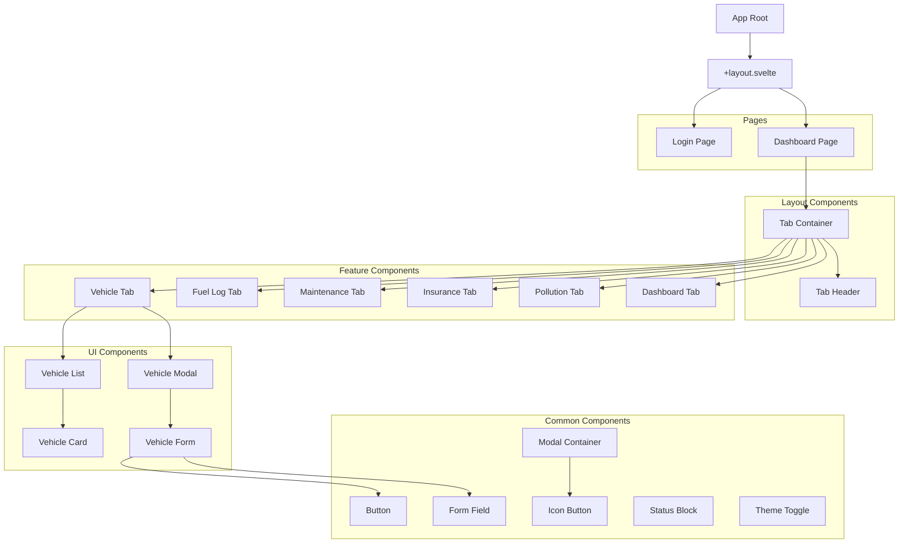
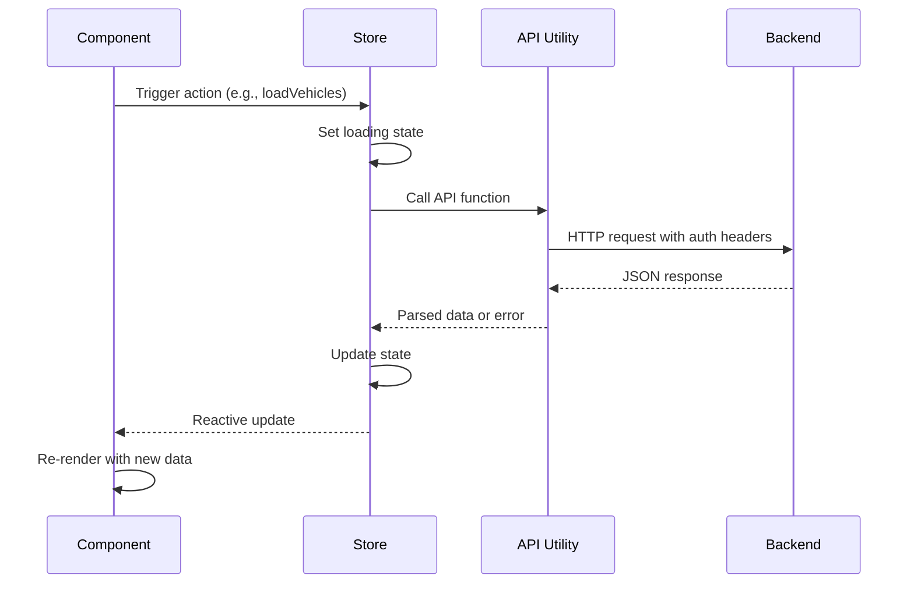

# Frontend Architecture

The Tracktor frontend is built with SvelteKit, providing a modern, reactive user interface with excellent performance characteristics. The architecture follows component-based design principles with clear separation of concerns and efficient state management.

## Technology Stack

### Core Framework

- **SvelteKit 2.x**: Full-stack framework with file-based routing
- **Svelte 5**: Component framework with compile-time optimizations
- **TypeScript**: Type safety and enhanced developer experience
- **Vite 7.x**: Fast build tool with hot module replacement

### Styling & UI

- **Tailwind CSS 4.x**: Utility-first CSS framework
- **Tailwind Forms**: Enhanced form styling
- **Tailwind Typography**: Rich text styling
- **Custom CSS**: Component-specific styles when needed

### Libraries & Utilities

- **Chart.js**: Data visualization with svelte5-chartjs wrapper
- **Lucide Svelte**: Icon library
- **date-fns**: Date manipulation utilities
- **Svelte Loading Spinners**: Loading state indicators

## Project Structure

```
src/
├── app.d.ts                 # Global type definitions
├── app.html                 # HTML template
├── components/              # Reusable UI components
│   ├── auth/               # Authentication components
│   ├── chart/              # Chart and visualization components
│   ├── common/             # Shared UI components
│   ├── forms/              # Form components
│   ├── lists/              # List display components
│   ├── modals/             # Modal dialog components
│   └── tabs/               # Tab-based navigation components
├── lib/                    # Shared utilities and logic
│   ├── models/             # TypeScript type definitions
│   ├── stores/             # State management
│   └── utils/              # Utility functions
├── routes/                 # File-based routing
│   ├── +layout.svelte      # Root layout component
│   ├── +page.svelte        # Home page
│   ├── login/              # Login page
│   └── dashboard/          # Main application dashboard
└── styles/                 # Global styles
    └── app.css             # Main stylesheet
```

## Component Architecture

### Component Hierarchy



### Component Categories

#### 1. Page Components

- **Purpose**: Top-level route components that define page structure
- **Location**: `src/routes/`
- **Examples**: Login page, Dashboard page
- **Responsibilities**: Layout definition, route-specific logic, SEO metadata

#### 2. Layout Components

- **Purpose**: Shared structural components used across pages
- **Location**: `src/components/common/`
- **Examples**: TabContainer, ModalContainer
- **Responsibilities**: Navigation, common UI patterns, responsive layout

#### 3. Feature Components

- **Purpose**: Domain-specific components for vehicle management features
- **Location**: `src/components/tabs/`, `src/components/forms/`, `src/components/lists/`
- **Examples**: VehicleForm, FuelLogList, MaintenanceTab
- **Responsibilities**: Feature-specific logic, data display, user interactions

#### 4. Common Components

- **Purpose**: Reusable UI elements used throughout the application
- **Location**: `src/components/common/`
- **Examples**: Button, FormField, StatusBlock
- **Responsibilities**: Consistent styling, accessibility, reusable behavior

## State Management

### Store Architecture

The application uses Svelte's built-in store system with a singleton pattern for global state management:

```typescript
// Store Structure
stores/
├── auth.ts              # Authentication state
├── config.ts            # Application configuration
├── dark-mode.ts         # Theme preferences
├── fuel-log.ts          # Fuel log data and operations
├── insurance.ts         # Insurance data and operations
├── maintenance.ts       # Maintenance log data and operations
├── pucc.ts             # Pollution certificate data
└── vehicle.ts          # Vehicle data and operations
```

### State Management Patterns

#### 1. Singleton Pattern

```typescript
export class AuthState {
  private static instance: AuthState;

  public static getInstance(currentRoute: string): AuthState {
    if (!AuthState.instance) {
      AuthState.instance = new AuthState(currentRoute);
    }
    return AuthState.instance;
  }
}
```

#### 2. Reactive Stores

```typescript
import { writable } from "svelte/store";

export const vehicles = writable<Vehicle[]>([]);
export const selectedVehicle = writable<Vehicle | null>(null);
export const isLoading = writable<boolean>(false);
```

#### 3. Derived Stores

```typescript
import { derived } from "svelte/store";

export const vehicleCount = derived(vehicles, ($vehicles) => $vehicles.length);
```

## Routing & Navigation

### File-Based Routing

SvelteKit uses file-based routing where the file structure in `src/routes/` determines the URL structure:

```
routes/
├── +layout.svelte       # Root layout (applies to all routes)
├── +page.svelte         # Home page (/)
├── login/
│   └── +page.svelte     # Login page (/login)
└── dashboard/
    └── +page.svelte     # Dashboard page (/dashboard)
```

### Navigation Flow

1. **Initial Load**: User visits application URL
2. **Authentication Check**: Layout component checks authentication state
3. **Route Protection**: Redirect to login if not authenticated
4. **Page Rendering**: Render appropriate page component
5. **Client-Side Navigation**: SvelteKit handles subsequent navigation

### Route Guards

```typescript
// In +layout.svelte
import { goto } from "$app/navigation";
import { page } from "$app/stores";
import { AuthState } from "$lib/stores/auth";

$: {
  const auth = AuthState.getInstance($page.url.pathname);
  if (!auth.getIsAuthenticated() && $page.url.pathname !== "/login") {
    goto("/login");
  }
}
```

## Data Flow & API Integration

### API Communication Pattern



### API Integration

```typescript
// API utility pattern
export async function fetchVehicles(): Promise<Vehicle[]> {
  const pin = localStorage.getItem("userPin");
  const response = await fetch("/api/vehicles", {
    headers: {
      "Content-Type": "application/json",
      "X-User-PIN": pin || "",
    },
  });

  if (!response.ok) {
    throw new Error(`HTTP ${response.status}: ${response.statusText}`);
  }

  return response.json();
}
```

### Error Handling

```typescript
// Store error handling pattern
export const vehicleStore = {
  vehicles: writable<Vehicle[]>([]),
  error: writable<string | null>(null),
  isLoading: writable<boolean>(false),

  async loadVehicles() {
    this.isLoading.set(true);
    this.error.set(null);

    try {
      const vehicles = await fetchVehicles();
      this.vehicles.set(vehicles);
    } catch (error) {
      this.error.set(error.message);
    } finally {
      this.isLoading.set(false);
    }
  },
};
```

## Styling Architecture

### Tailwind CSS Configuration

```javascript
// tailwind.config.js
export default {
  content: ["./src/**/*.{html,js,svelte,ts}"],
  theme: {
    extend: {
      colors: {
        primary: {
          50: "#eff6ff",
          500: "#3b82f6",
          900: "#1e3a8a",
        },
      },
    },
  },
  plugins: [require("@tailwindcss/forms"), require("@tailwindcss/typography")],
};
```

### Component Styling Patterns

#### 1. Utility-First Approach

```svelte
<button class="bg-blue-500 hover:bg-blue-700 text-white font-bold py-2 px-4 rounded">
  Click me
</button>
```

#### 2. Component Classes

```svelte
<style>
  .vehicle-card {
    @apply bg-white shadow-md rounded-lg p-6 border border-gray-200;
  }

  .vehicle-card:hover {
    @apply shadow-lg border-gray-300;
  }
</style>
```

#### 3. Responsive Design

```svelte
<div class="grid grid-cols-1 md:grid-cols-2 lg:grid-cols-3 gap-4">
  <!-- Responsive grid layout -->
</div>
```

## Performance Optimizations

### Code Splitting

- **Route-based splitting**: Automatic with SvelteKit
- **Component lazy loading**: Dynamic imports for large components
- **Bundle analysis**: Vite bundle analyzer for optimization

### Reactive Optimizations

- **Selective subscriptions**: Only subscribe to needed store slices
- **Derived store caching**: Automatic memoization of computed values
- **Component lifecycle**: Proper cleanup of subscriptions and timers

### Asset Optimization

- **Image optimization**: Responsive images with proper sizing
- **Icon optimization**: SVG icons with tree-shaking
- **CSS purging**: Tailwind CSS purges unused styles

## Development Workflow

### Hot Module Replacement

- **Component updates**: Instant component reloading
- **Store updates**: State preservation during development
- **Style updates**: CSS hot reloading without page refresh

### Type Safety

- **Component props**: TypeScript interfaces for all props
- **Store typing**: Strongly typed store definitions
- **API responses**: Type-safe API response handling

### Testing Strategy

- **Component testing**: Svelte Testing Library for component tests
- **Integration testing**: Playwright for end-to-end testing
- **Type checking**: TypeScript compiler for static analysis

This frontend architecture provides a scalable, maintainable foundation for the Tracktor application while leveraging modern web development best practices and Svelte's unique advantages.
