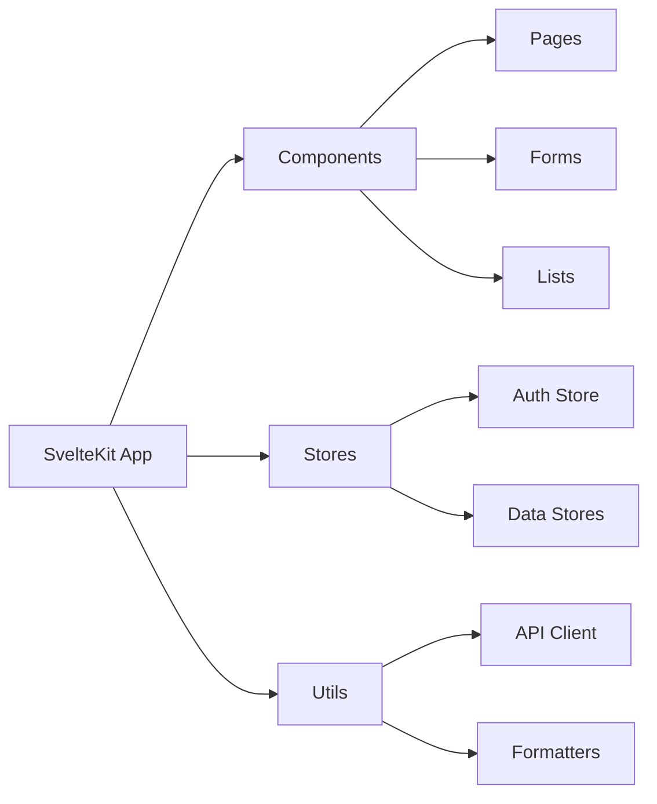
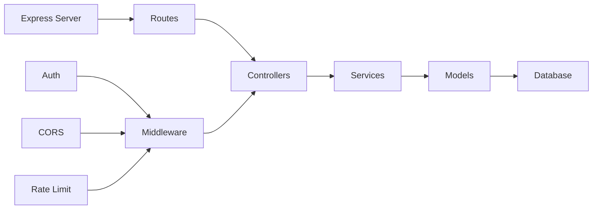
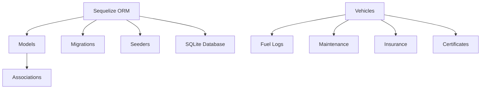

# Architecture Documentation

This section provides comprehensive documentation of the Tracktor application's architecture, covering system design, component interactions, and technical implementation details.

## Architecture Overview

Tracktor follows a modern three-tier architecture pattern with clear separation between presentation, business logic, and data layers. The system is designed for simplicity, maintainability, and future scalability.

### Quick Navigation

- **[System Overview](./overview.md)** - High-level architecture and technology stack
- **[Frontend Architecture](./frontend-architecture.md)** - SvelteKit frontend design and patterns
- **[Backend Architecture](./backend-architecture.md)** - Node.js/Express backend structure
- **[Database Schema](./database-schema.md)** - SQLite database design and relationships

## Architecture Highlights

### Technology Stack

- **Frontend**: SvelteKit 2.x with TypeScript and Tailwind CSS
- **Backend**: Node.js with Express.js and TypeScript
- **Database**: SQLite with Sequelize ORM
- **Authentication**: PIN-based with bcrypt hashing
- **Build Tools**: Vite for frontend, tsx for backend development

### Key Design Principles

#### 1. Separation of Concerns

Each layer has distinct responsibilities:

- **Frontend**: User interface and client-side logic
- **Backend**: Business logic and API endpoints
- **Database**: Data persistence and integrity

#### 2. Type Safety

Full TypeScript coverage across the entire stack ensures:

- Compile-time error detection
- Enhanced developer experience
- Better code maintainability
- Clear interface contracts

#### 3. Security First

- PIN-based authentication with secure hashing
- CORS configuration with explicit origin allowlisting
- Input validation and sanitization
- Rate limiting and error handling

#### 4. Developer Experience

- Hot module replacement for fast development
- Comprehensive error handling and logging
- Clear project structure and naming conventions
- Automated database migrations

## System Components

### Frontend Layer

### Backend Layer

### Data Layer

## Communication Patterns

### Client-Server Communication

- **Protocol**: HTTP/HTTPS with JSON payloads
- **Authentication**: PIN-based header authentication
- **Error Handling**: Structured error responses
- **State Management**: Client-side caching with server validation

### Data Flow

1. User interaction triggers component action
2. Component updates local state via Svelte stores
3. API request sent to Express backend with authentication
4. Controller validates input and delegates to service
5. Service implements business logic and calls model
6. Model interacts with SQLite database via Sequelize
7. Response flows back through layers to update UI

## Deployment Architecture

### Development Environment

- Frontend dev server (Vite) on port 5173
- Backend dev server (Express) on port 3000
- SQLite database file in backend directory
- Hot reloading for both frontend and backend

### Production Environment

- Single Node.js process serving both frontend and backend
- Static frontend assets served by Express
- SQLite database with proper file permissions
- Environment-based configuration
- Docker containerization support

## Performance Characteristics

### Frontend Performance

- **Bundle Size**: Optimized with Vite tree-shaking
- **Runtime**: Svelte's compile-time optimizations
- **Caching**: Browser caching for static assets
- **Loading**: Route-based code splitting

### Backend Performance

- **Response Time**: Sub-100ms for typical operations
- **Concurrency**: Node.js event loop efficiency
- **Database**: SQLite's excellent read performance
- **Memory**: Efficient with proper connection management

### Scalability Considerations

- **Current**: Optimized for single-user scenarios
- **Future**: Migration path to multi-user with PostgreSQL
- **Horizontal**: Load balancing support for multiple instances
- **Caching**: Redis integration for session management

## Security Architecture

### Authentication & Authorization

- PIN-based authentication with bcrypt hashing
- Header-based authentication for API requests
- No session management (stateless authentication)
- Rate limiting to prevent brute force attacks

### Data Protection

- Input validation and sanitization
- SQL injection prevention via ORM
- XSS protection with proper content headers
- CORS configuration with explicit origins

### Error Handling

- Secure error messages without information leakage
- Comprehensive logging for debugging
- Graceful degradation for system failures
- Transaction rollback for data consistency

## Development Workflow

### Code Organization

- Clear separation between frontend and backend code
- Consistent naming conventions and file structure
- TypeScript interfaces for all data contracts
- Comprehensive error handling patterns

### Database Management

- Version-controlled migrations for schema changes
- Transactional migrations for data integrity
- Seeder system for development and demo data
- Backup and restore procedures

### Quality Assurance

- ESLint and Prettier for code formatting
- TypeScript strict mode for type safety
- Comprehensive error handling and validation
- Performance monitoring and optimization

This architecture provides a solid foundation for the Tracktor application while maintaining the flexibility to evolve with changing requirements and scale as needed.
