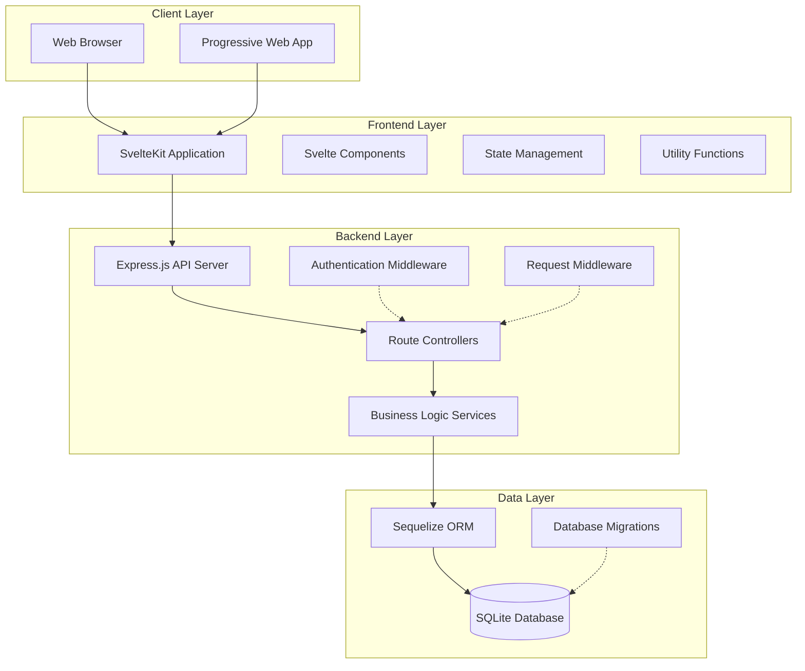

# System Architecture Overview

Tracktor is a full-stack vehicle tracking application built with a modern web architecture that separates concerns between frontend, backend, and data layers. The system follows a traditional three-tier architecture pattern with clear separation of presentation, business logic, and data persistence layers.

## High-Level Architecture

## Technology Stack

### Frontend

- **Framework**: SvelteKit 2.x with Svelte 5
- **Styling**: Tailwind CSS 4.x with custom components
- **Build Tool**: Vite 7.x
- **State Management**: Svelte stores with singleton patterns
- **Charts**: Chart.js with Svelte wrapper
- **Icons**: Lucide Svelte
- **Type Safety**: TypeScript

### Backend

- **Runtime**: Node.js with Express.js 4.x
- **Language**: TypeScript with ES modules
- **ORM**: Sequelize 6.x
- **Database**: SQLite 3
- **Authentication**: PIN-based with bcrypt hashing
- **API Documentation**: Swagger/OpenAPI 3.0
- **Security**: CORS, rate limiting, input validation

### Development & Deployment

- **Package Manager**: npm
- **Containerization**: Docker with multi-stage builds
- **Documentation**: VitePress
- **Code Quality**: ESLint, Prettier, TypeScript strict mode
- **Database Migrations**: Umzug with Sequelize

## Architecture Principles

### 1. Separation of Concerns

- **Frontend**: Handles presentation logic, user interactions, and client-side state
- **Backend**: Manages business logic, data validation, and API endpoints
- **Database**: Stores persistent data with proper relationships and constraints

### 2. RESTful API Design

- Clear HTTP method semantics (GET, POST, PUT, DELETE)
- Resource-based URL structure (`/api/vehicles`, `/api/fuel-logs`)
- Consistent response formats with proper status codes
- Comprehensive error handling and validation

### 3. Security-First Approach

- PIN-based authentication with secure hashing
- CORS configuration with explicit origin allowlisting
- Input validation and sanitization
- Rate limiting to prevent abuse
- Secure headers and middleware

### 4. Data Integrity

- Foreign key constraints in database schema
- Transaction-based operations for data consistency
- Proper migration system for schema changes
- Validation at both client and server levels

## System Components

### Frontend Components

- **Pages**: Route-based page components (`/login`, `/dashboard`)
- **Layout Components**: Shared UI elements (navigation, modals)
- **Feature Components**: Domain-specific components (vehicle forms, charts)
- **Utility Components**: Reusable UI elements (buttons, form fields)

### Backend Components

- **Controllers**: Handle HTTP requests and responses
- **Services**: Implement business logic and data operations
- **Models**: Define data structures and relationships
- **Middleware**: Cross-cutting concerns (auth, error handling, logging)

### Data Components

- **Models**: Sequelize model definitions with associations
- **Migrations**: Version-controlled schema changes
- **Seeders**: Development and demo data population
- **Configuration**: Environment-based database settings

## Communication Patterns

### Client-Server Communication

- **Protocol**: HTTP/HTTPS with JSON payloads
- **Authentication**: PIN-based with header transmission
- **Error Handling**: Structured error responses with proper status codes
- **State Synchronization**: Client-side caching with server validation

### Data Flow

1. **User Interaction**: User performs action in Svelte component
2. **State Update**: Local state updated via Svelte stores
3. **API Request**: HTTP request sent to Express.js backend
4. **Authentication**: PIN validation via middleware
5. **Business Logic**: Controller delegates to service layer
6. **Data Persistence**: Service uses Sequelize to interact with SQLite
7. **Response**: JSON response sent back to client
8. **UI Update**: Component reactively updates based on new state

## Deployment Architecture

### Development Environment

- Frontend dev server (Vite) on port 5173
- Backend dev server (Express) on port 3000
- SQLite database file in backend directory
- Hot reloading for both frontend and backend

### Production Environment

- Single Node.js process serving both frontend and backend
- Static frontend assets served by Express
- SQLite database with proper file permissions
- Environment-based configuration
- Docker containerization for consistent deployment

## Scalability Considerations

### Current Architecture Benefits

- **Lightweight**: SQLite eliminates database server overhead
- **Simple Deployment**: Single process, minimal dependencies
- **Development Speed**: Fast iteration with hot reloading
- **Type Safety**: Full TypeScript coverage prevents runtime errors

### Future Scaling Options

- **Database**: Migration path to PostgreSQL/MySQL for multi-user scenarios
- **Caching**: Redis integration for session management and caching
- **Load Balancing**: Horizontal scaling with multiple backend instances
- **Microservices**: Service decomposition for complex business logic
- **CDN**: Static asset distribution for global performance

## Security Architecture

### Authentication Flow

1. User enters PIN on login page
2. PIN hashed with bcrypt and compared to stored hash
3. Successful authentication stores PIN in localStorage
4. Subsequent requests include PIN in `X-User-PIN` header
5. Middleware validates PIN on protected routes

### Data Protection

- **Input Validation**: Joi/Zod schemas for request validation
- **SQL Injection Prevention**: Sequelize ORM with parameterized queries
- **XSS Protection**: Content Security Policy headers
- **CSRF Protection**: SameSite cookie configuration
- **Rate Limiting**: Express rate limiter for API endpoints

## Performance Characteristics

### Frontend Performance

- **Bundle Size**: Optimized with Vite tree-shaking and code splitting
- **Runtime Performance**: Svelte's compile-time optimizations
- **Caching**: Browser caching for static assets
- **Lazy Loading**: Route-based code splitting

### Backend Performance

- **Database**: SQLite's excellent read performance for single-user scenarios
- **Memory Usage**: Efficient with Sequelize connection pooling
- **Response Times**: Sub-100ms for typical CRUD operations
- **Concurrency**: Node.js event loop handles concurrent requests efficiently

This architecture provides a solid foundation for a personal vehicle tracking application while maintaining simplicity and the ability to scale as requirements grow.
