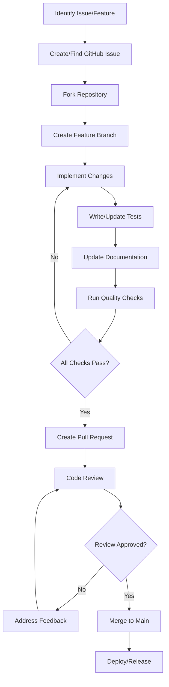

# Contributing to Tracktor

Welcome to the Tracktor contributing guide! We're excited that you're interested in contributing to our open-source vehicle management application. This section provides everything you need to know about contributing to the project.

## Quick Start for Contributors

### New Contributors

If you're new to the project:

1. **[Read the Contributing Guidelines](./guidelines.md)** - Understand our development process
2. **[Set Up Your Environment](/developer-guide/development/setup.md)** - Get your development environment ready
3. **[Learn Our Coding Standards](/developer-guide/development/coding-standards.md)** - Understand our code quality expectations
4. **[Review the Pull Request Process](./pull-requests.md)** - Learn how to submit your contributions

### Experienced Contributors

If you're familiar with the project:

1. **[Pull Request Guidelines](./pull-requests.md)** - Detailed PR submission process
2. **[Documentation Updates](./documentation-updates.md)** - How to contribute to documentation
3. **[Architecture Overview](/developer-guide/architecture/overview.md)** - Understand the system design

## Ways to Contribute

### 🐛 Bug Reports and Fixes

- **Report Bugs**: Help us identify issues by creating detailed bug reports
- **Fix Bugs**: Resolve existing issues and improve application stability
- **Regression Testing**: Help prevent bugs from reoccurring

### ✨ Feature Development

- **New Features**: Implement new functionality that enhances the application
- **Feature Requests**: Suggest improvements and new capabilities
- **User Experience**: Improve the interface and user interactions

### 📚 Documentation

- **User Guides**: Help users understand how to use the application
- **Developer Docs**: Improve technical documentation for contributors
- **API Documentation**: Keep API documentation current and comprehensive
- **Tutorials**: Create step-by-step guides for common tasks

### 🧪 Testing and Quality Assurance

- **Write Tests**: Add unit, integration, and end-to-end tests
- **Test Coverage**: Improve test coverage for existing code
- **Performance Testing**: Help identify and resolve performance issues
- **Cross-browser Testing**: Ensure compatibility across different browsers

### 🎨 Design and User Experience

- **UI/UX Improvements**: Enhance the user interface and experience
- **Accessibility**: Make the application more accessible to all users
- **Mobile Responsiveness**: Improve mobile device compatibility
- **Visual Design**: Contribute to the visual design and branding

## Contribution Process Overview



## Getting Started

### 1. Choose Your Contribution Type

#### First-Time Contributors

Look for issues labeled:

- `good first issue` - Perfect for newcomers
- `help wanted` - Community assistance needed
- `documentation` - Documentation improvements

#### Experienced Contributors

Consider:

- `enhancement` - New features and improvements
- `bug` - Bug fixes and stability improvements
- `performance` - Performance optimizations
- `refactoring` - Code quality improvements

### 2. Set Up Your Development Environment

```bash
# Fork and clone the repository
git clone https://github.com/your-username/tracktor.git
cd tracktor

# Install dependencies
npm install

# Set up environment
npm run setup

# Start development servers
npm run dev
```

### 3. Understand the Codebase

#### Project Structure

```
tracktor/
├── app/
│   ├── backend/           # Node.js/Express API server
│   ├── frontend/          # SvelteKit web application
│   └── docs/              # VitePress documentation site
├── docker/                # Docker configuration files
├── scripts/               # Build and utility scripts
└── docs/                  # Additional project documentation
```

#### Technology Stack

- **Frontend**: SvelteKit, TypeScript, Tailwind CSS
- **Backend**: Node.js, Express.js, TypeScript, Sequelize
- **Database**: SQLite
- **Documentation**: VitePress
- **Testing**: Vitest, Playwright
- **Deployment**: Docker, Docker Compose

### 4. Make Your Contribution

Follow our detailed guides:

- **[Contributing Guidelines](./guidelines.md)** - Complete contribution process
- **[Pull Request Guidelines](./pull-requests.md)** - PR submission and review
- **[Documentation Updates](./documentation-updates.md)** - Documentation contributions

## Community and Support

### Communication Channels

- **GitHub Issues**: Bug reports and feature requests
- **GitHub Discussions**: General questions and community discussions
- **Pull Request Comments**: Code-specific discussions
- **Documentation**: Comprehensive guides and references

### Getting Help

1. **Check Existing Documentation**: Review guides and FAQs first
2. **Search Issues**: Look for similar questions or problems
3. **Ask Questions**: Open a GitHub discussion for help
4. **Contact Maintainers**: Reach out for complex issues

### Code of Conduct

We are committed to providing a welcoming and inclusive environment:

- **Be Respectful**: Treat all community members with kindness
- **Be Inclusive**: Welcome newcomers and diverse perspectives
- **Be Constructive**: Provide helpful feedback and suggestions
- **Be Patient**: Remember that everyone has different experience levels
- **Be Professional**: Keep discussions focused and productive

## Recognition and Rewards

### Contributor Recognition

We value all contributions and recognize contributors through:

- **Contributor List**: Listed in project contributors
- **Release Notes**: Acknowledged in release announcements
- **Community Highlights**: Featured in community updates
- **Mentorship Opportunities**: Opportunities to help other contributors

### Types of Contributions We Value

- Code contributions (features, fixes, improvements)
- Documentation improvements and additions
- Bug reports and feature requests
- Code reviews and feedback
- Community support and mentoring
- Testing and quality assurance
- Design and user experience improvements
- Performance optimizations
- Security improvements

## Development Resources

### Essential Reading

- **[Development Setup](/developer-guide/development/setup.md)** - Environment configuration
- **[Architecture Overview](/developer-guide/architecture/overview.md)** - System design
- **[Coding Standards](/developer-guide/development/coding-standards.md)** - Code quality guidelines
- **[Testing Guide](/developer-guide/development/testing.md)** - Testing strategies
- **[Debugging Guide](/developer-guide/development/debugging.md)** - Troubleshooting help

### API and Technical References

- **[API Documentation](/developer-guide/api/)** - Complete API reference
- **[Database Schema](/developer-guide/architecture/database-schema.md)** - Database design
- **[Frontend Architecture](/developer-guide/architecture/frontend-architecture.md)** - Frontend patterns
- **[Backend Architecture](/developer-guide/architecture/backend-architecture.md)** - Backend patterns

## Contribution Workflow

### Planning Phase

1. **Identify Need**: Find an issue or identify an improvement opportunity
2. **Research**: Understand the current implementation and requirements
3. **Design**: Plan your approach and discuss with maintainers if needed
4. **Estimate**: Consider the scope and complexity of the change

### Implementation Phase

1. **Set Up**: Prepare your development environment
2. **Code**: Implement your changes following our standards
3. **Test**: Write and run tests for your changes
4. **Document**: Update relevant documentation
5. **Review**: Self-review your code before submission

### Submission Phase

1. **Prepare**: Ensure all quality checks pass
2. **Submit**: Create a detailed pull request
3. **Engage**: Respond to feedback and questions
4. **Iterate**: Make requested changes and improvements
5. **Merge**: Celebrate when your contribution is merged!

## Frequently Asked Questions

### Q: How do I get started as a new contributor?

**A:** Start by reading our [Contributing Guidelines](./guidelines.md), setting up your [development environment](/developer-guide/development/setup.md), and looking for issues labeled `good first issue`.

### Q: What if I'm not sure about my approach?

**A:** Open a GitHub issue or discussion to discuss your approach before implementing. We're happy to provide guidance and feedback.

### Q: How long does the review process take?

**A:** We aim to provide initial feedback within 2 business days. The complete review process depends on the complexity of the changes.

### Q: Can I work on multiple issues at once?

**A:** We recommend focusing on one issue at a time, especially for new contributors. This helps ensure quality and makes the review process smoother.

### Q: What if my PR is rejected?

**A:** We provide detailed feedback on why changes might be rejected. You can address the feedback and resubmit, or discuss alternative approaches.

### Q: How do I stay updated on project changes?

**A:** Watch the repository on GitHub, follow release notes, and participate in community discussions to stay informed about project updates.

## Next Steps

Ready to contribute? Here's what to do next:

1. **Choose a contribution type** that matches your interests and skills
2. **Read the relevant guides** for detailed instructions
3. **Set up your development environment** following our setup guide
4. **Find or create an issue** to work on
5. **Start contributing** and join our community!

Thank you for your interest in contributing to Tracktor. Your contributions help make this project better for everyone in the community!
