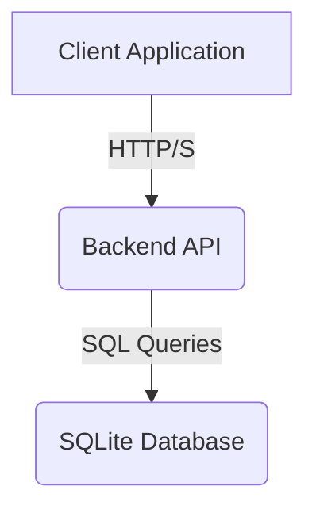
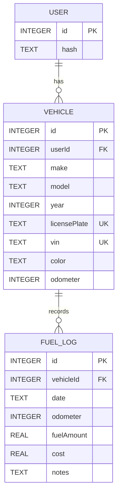

# Introduction

Tracktor is a comprehensive web application designed to simplify the management of your vehicle's lifecycle. Whether you have a single car or a small fleet, Tracktor provides the tools you need to stay organized and keep your vehicles in optimal condition.

## What is Tracktor?

At its core, Tracktor is a centralized dashboard for all your vehicle-related information. It allows you to meticulously track:

*   **Vehicle Details:** Store and manage essential information about your vehicles, including make, model, year, VIN, license plate, and more.
*   **Fuel Consumption:** Log every refuel and let Tracktor automatically calculate your vehicle's fuel efficiency over time. This helps you monitor performance and identify potential issues early.
*   **Maintenance History:** Keep a detailed log of all maintenance activities, from simple oil changes to major repairs. A complete service history can significantly increase a vehicle's resale value.
*   **Important Documents:** Never miss a renewal date again. Tracktor helps you manage critical documents like insurance policies and pollution certificates, with upcoming features for renewal reminders.

## How Tracktor Can Help You

Tracktor is designed to save you time, money, and stress by:

*   **Improving Organization:** No more sifting through glove compartments or messy folders for vehicle documents. Everything is stored securely in one place, accessible from anywhere.
*   **Enhancing Vehicle Longevity:** By keeping a close eye on fuel efficiency and maintaining a consistent service history, you can extend the life of your vehicle and prevent costly breakdowns.
*   **Boosting Resale Value:** A well-documented service history is a major selling point for potential buyers. Tracktor provides a professional and detailed record of your vehicle's care.
*   **Providing Peace of Mind:** With reminders for important dates and a clear overview of your vehicle's health, you can drive with confidence, knowing that everything is up-to-date and in good order.

This documentation will guide you through deploying your own instance of Tracktor, understanding its API, and contributing to its development.

## System Architecture

## Database Schema

